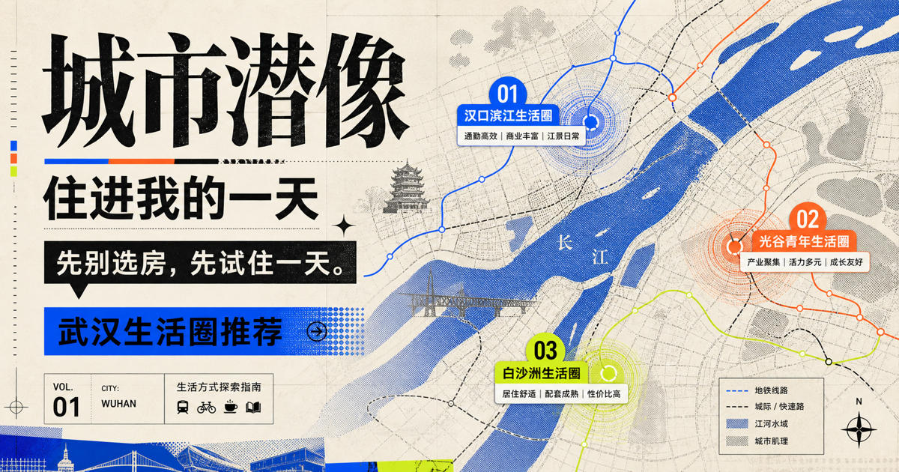

# City Afterimage / 城市潜像

> **City Afterimage turns the day you want to repeat into explainable neighborhood decisions.**
>
> 城市潜像把你想重复的一天，转译成可解释的生活圈选择。

City Afterimage is an explainable relocation decision agent for people starting a life in an unfamiliar city. Instead of asking users to describe an “ideal neighborhood,” it lets them choose between concrete life scenes, edit the resulting lifestyle profile before any place name is revealed, and then connects that profile to map evidence and three distinct Wuhan living-circle recommendations.

[**Live demo**](https://city-afterimage-lab.bigdraw123.chatgpt.site/) · [**90-second pitch video**](https://city-afterimage-lab.bigdraw123.chatgpt.site/video-pitch/watch.html) · [**Judge mode**](https://city-afterimage-lab.bigdraw123.chatgpt.site/?judge=1) · [OpenArena submission kit](./OPENARENA.md) · [中文说明](#中文说明)



## The problem

Relocation tools usually start with listings, rent, or abstract preference forms. But the decision people actually live with is more ordinary:

> After work on a Wednesday night, can the rest of my day still happen?

City Afterimage starts from that repeatable day. It combines real constraints—office location, schedule, commute ceiling, mobility, and personal anchors—with forced choices about food, quiet, social distance, urban texture, nature, and weekend range.

The product does **not** claim to find an objectively perfect home. It produces an **evidence-backed, explainable decision** that users can inspect, disagree with, and replan.

## 90-second judge path

Open [`?judge=1`](https://city-afterimage-lab.bigdraw123.chatgpt.site/?judge=1). The preloaded case is a design/content worker near Guanggu Software Park, leaving at 19:30 with a 40-minute commute ceiling.

1. **Recognize the life profile before seeing place names.** Read and confirm the generated “afterimage.”
2. **Reveal three different decisions.** Inspect the map, evidence passport, recommendation reasons, trade-off, and simulated weekday/weekend.
3. **Tighten commute by five minutes.** Watch `40 → 35 min`, the affected recommendation role, supporting evidence, and the day plan replan together.

This path demonstrates the full loop without asking a judge to complete the 3–4 minute onboarding.

## The agent loop

```text
Real constraints + scene choices
            ↓
Lifestyle afterimage before place-name reveal
            ↓
Candidate living circles + route/facility evidence
            ↓
Three decision roles: best fit / least friction / growth self
            ↓
Weekday and weekend simulation + explicit trade-off
            ↓
User disagreement or constraint change
            ↓
Immediate re-ranking, evidence update, and day replan
```

The current agent is deliberately structured and deterministic: it can explain which input and evidence changed a score. An LLM may polish confirmed facts through the reserved narration boundary, but it is not allowed to invent places, distances, facilities, or travel times. The complete demo works without an LLM key.

## What is implemented

- Six “title + profession” entry cards; profession only supplies an editable work-schedule default and never acts as a personality score.
- Wuhan address search, stable demo presets, and verified aliases for Huawei Wuhan Research Institute in the Future Science and Technology City direction.
- Five core scene duels plus one adaptive duel; every question supports a clear A/B decision or skip.
- “Edit a day” interactions for three weekday-evening and three weekend-morning priorities.
- A six-axis lifestyle afterimage: convenience, quiet, social energy, urban texture, nature, and weekend radius.
- 22 curated Wuhan living-circle seeds represented as flexible ~1.5 km daily-life radii, not administrative boundaries.
- Three non-duplicate result roles: **Best fit**, **Least friction**, and **The self you may grow into**.
- Explainable ranking across commute, facilities/mobility, rhythm, social/night needs, texture/nature, and personal anchors.
- Real-coordinate map centered on each recommendation, with filterable metro, bus, park, medical, grocery/market, and food facilities.
- An evidence passport that distinguishes user evidence, address source, commute source, facility source, and recommendation model.
- “Like / Not me” evidence feedback plus quick replans for commute, nature, and late-night needs.
- A structured weekday and weekend simulation grounded in the current recommendation evidence.
- A local 1080 × 1440 share cover that never includes the exact office address.
- Desktop, 390 px mobile, keyboard focus, reduced-motion, loading, and map-failure states.
- A local cat guide that reacts to choices, explains trade-offs, and invites another round without turning the product into a chat toy.

## Evidence passport and honest data states

Every result distinguishes where its evidence came from:

| Evidence | Live state | Fallback state |
| --- | --- | --- |
| User intent | Scene choices, edited day, commute ceiling | Same local session data |
| Address | Amap Web Service geocoding | Verified demo coordinates or clearly marked stable demo position |
| Commute | Amap route result | Model estimate, explicitly labelled as an estimate |
| Nearby facilities | Amap POI or OpenStreetMap/Overpass | Curated demo list; unverified facility coordinates are not plotted |
| Recommendation | Structured preferences + curated living-circle features | Same transparent ranking model |

The interface displays the active state. It never describes estimated commuting as a live route, nor demo facilities as verified real-time POIs.

### Not integrated

This repository does **not** scrape or claim real-time access to Dianping, Meituan, Xiaohongshu, rent listings, or social-media popularity. Those platforms are future partner-adapter boundaries only. Activity evidence should first come from official organizers/venues, dated manual curation, or a link deliberately supplied by the user.

## Recommendation model

Default decision weights:

| Dimension | Weight |
| --- | ---: |
| Commute fit | 35% |
| Facilities and mobility | 25% |
| Daily rhythm | 15% |
| Social and late-night needs | 10% |
| Nature and urban texture | 10% |
| Personal anchors | 5% |

Exceeding the user’s commute ceiling triggers a hard penalty. The three result roles are selected with different objectives rather than displaying the top three scores under one formula:

- **Best fit / 最合拍** — highest overall match.
- **Least friction / 最省力** — lowest commute and daily-life friction.
- **Growth self / 最可能长成的你** — still feasible, but closer to the user’s aspirational nature, exploration, or urban-texture preferences.

## Privacy

- Office address, optional anchors, and preferences stay in page memory and disappear on refresh.
- In live address mode, a search query is sent to Amap; the interface discloses this before use.
- Without an Amap key, the result map may request public road/facility data from OpenStreetMap and Overpass and shows the active attribution.
- Exact office and private-anchor addresses are excluded from the share image.
- No user account, tracking profile, rental transaction, or cloud history is required.
- The output is a shortlist for exploration, not a safety, medical-access, pricing, availability, or signing guarantee. Users should verify a neighborhood in person before moving.

## Run locally

Requirements: Node.js **22.13+** and npm.

```bash
git clone https://github.com/leinstein908/city-afterimage.git
cd city-afterimage
npm install
npm run dev
```

Open the local URL printed by the terminal. Use `/?judge=1` for the preloaded judge path or complete the full 3–4 minute experience from the home page.

### Optional Amap configuration

The complete experience runs in fixture/open-data mode without a key. To enable Amap address, route, and POI requests:

```bash
cp .env.example .env.local
```

Then add a server-side Web Service key:

```text
AMAP_WEB_SERVICE_KEY=your_server_side_web_service_key
```

Never commit `.env.local` or a production key.

### Build and verify

Run the quality gates serially:

```bash
npm run build
npm test
npm run lint
```

`npm test` also performs a production build before the Node test suite.

## API boundaries

```text
GET  /api/places?q=address-or-place
POST /api/living-circles/recommend
POST /api/living-circles/feedback
POST /api/narrate
```

Primary types live in `lib/living-types.ts`:

```text
UserProfile
LifestyleAfterimage
LivingCircle
Recommendation
DaySimulation
FeedbackAdjustment
```

The current public API is intentionally small. Replan deltas are calculated internally so the demo can make a before/after decision visible without exposing unstable implementation details.

## Project map

```text
app/page.tsx                         Single-page trial-living flow and result interactions
app/globals.css                      Editorial visual system, responsive states, motion
app/api/places                       Address search and verified offline fallbacks
app/api/living-circles/recommend     Recommendation and optional live commute
app/api/living-circles/feedback      Evidence feedback and re-ranking
app/api/map/context                  Amap / OSM facilities and source state
app/api/map/static                   Amap static-road proxy when configured
app/api/narrate                      Local narration template and optional LLM boundary
lib/living-data.ts                   Professions, scenes, activities, 22 living circles
lib/map-data.ts                      Coordinate, facility, provider, and fallback logic
lib/recommender.ts                   Profile, ranking, explanation, and day simulation
lib/living-export.ts                 Local private-magazine cover generation
OPENARENA.md                         Submission copy and English demo script
HACKATHON.md                         Chinese 3-minute pitch and FAQ
```

## OpenArena 2026

- **Project:** City Afterimage / 城市潜像
- **Primary track:** OPC / Super Individuals
- **Category:** Agent (if a category is required)
- **Submission description:** An explainable relocation decision agent that turns real-life constraints and the day a person wants to repeat into three Wuhan living-circle recommendations, then replans when the user disagrees.

The OPC story is not “one person made many screens.” One creator and AI collaborators completed product framing, interaction and visual design, structured recommendation logic, map integration, testing, and deployment—giving one relocating person a capability that normally requires a local guide, an agent, and a data analyst working together.

See [OPENARENA.md](./OPENARENA.md) for paste-ready form copy, the 90-second English demo, claims to avoid, and the post-deadline roadmap.

## 中文说明

城市潜像是一款面向异地入职者的**可解释迁居决策 Agent**。它不让用户填写高门槛开放问卷，也不从房源开始；用户只需校准真实班表、通勤底线，并在具体生活场景中做选择。系统会先在隐藏地名的情况下生成一段可修改的“生活潜像”，再把它连接到武汉地图证据、三个不同角色的生活圈，以及普通工作日和周末的模拟。

推荐不是“科学证明的最佳住处”，而是一份**有证据支撑、可反驳、能即时重规划的决策**。结果会区分高德实时数据、OpenStreetMap 开放数据、已核验演示坐标与模型估算；未接入大众点评、美团、小红书实时数据，也不抓取这些平台内容。

最快体验方式是打开 [90 秒评委模式](https://city-afterimage-lab.bigdraw123.chatgpt.site/?judge=1)：先确认不含地名的生活判断，再查看地图、证据护照和普通一天，最后把通勤上限从 40 分钟收紧到 35 分钟，观察推荐角色、证据和日程一起变化。

本地运行：

```bash
npm install
npm run dev
```

项目默认可在无地图 Key、无 LLM Key 的情况下完整运行。地址与偏好只保存在页面内存；分享封面不包含精确公司地址。当前结果用于缩小实地踩点范围，不替代搬家前的路线、设施、房租与安全核验。

## License

[MIT](./LICENSE)
